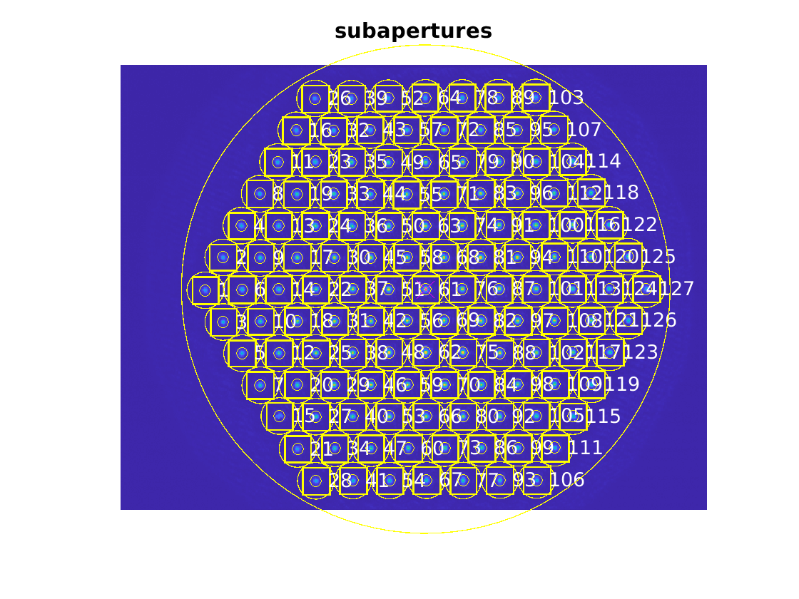
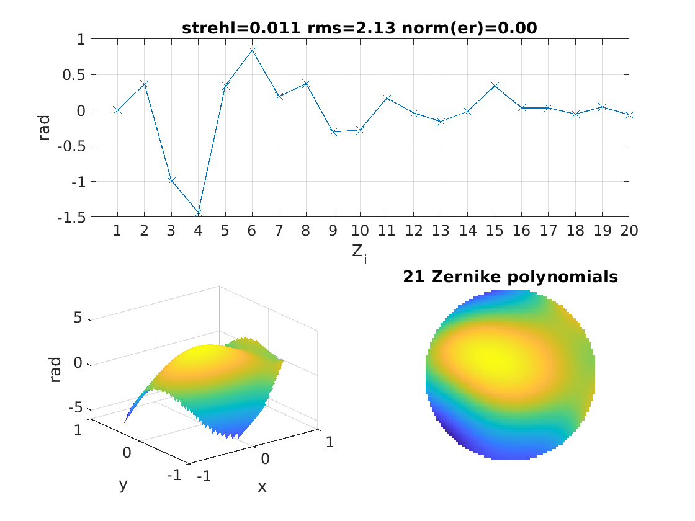
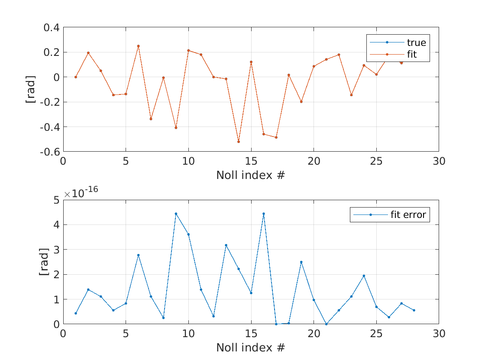

## calibration

Example about calibrating a SHWFS.

## reconstruction

Example about estimating the wavefront from a SHWFS image. You need to run `calibration.m` once first. After that you can estimate multiple wavefronts.

## zernike_polynomials

Example about plotting, fitting, and transforming Zernike polynomials.
